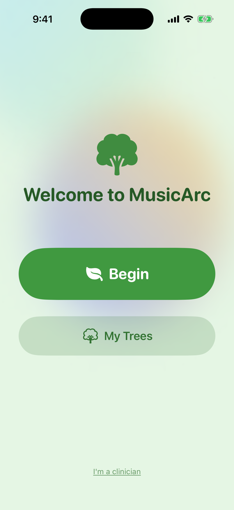
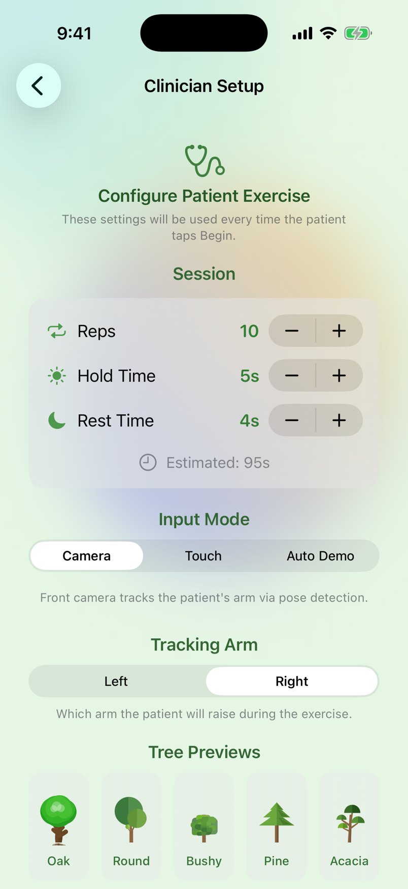
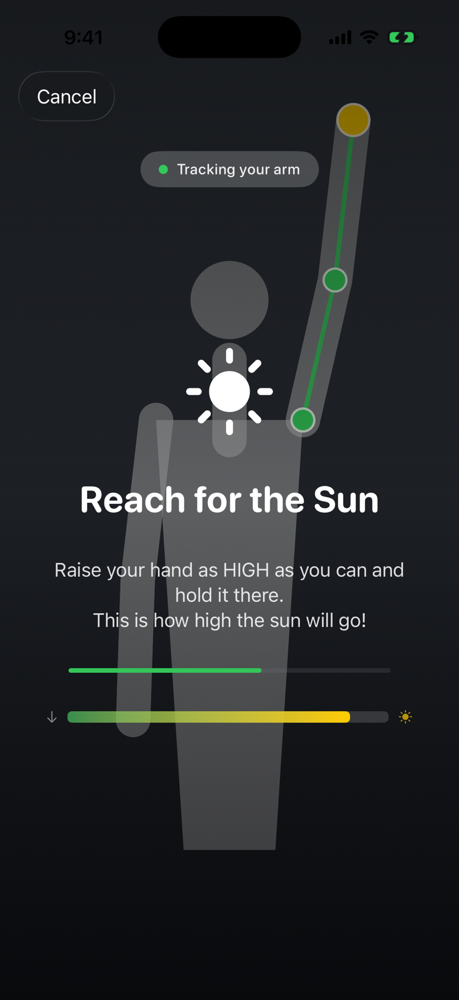
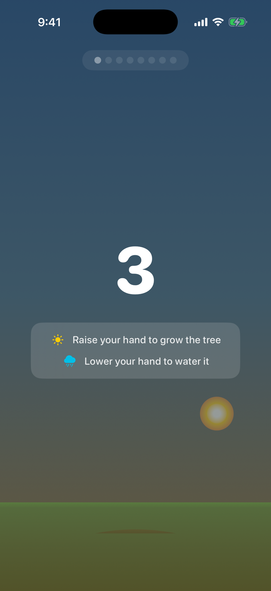
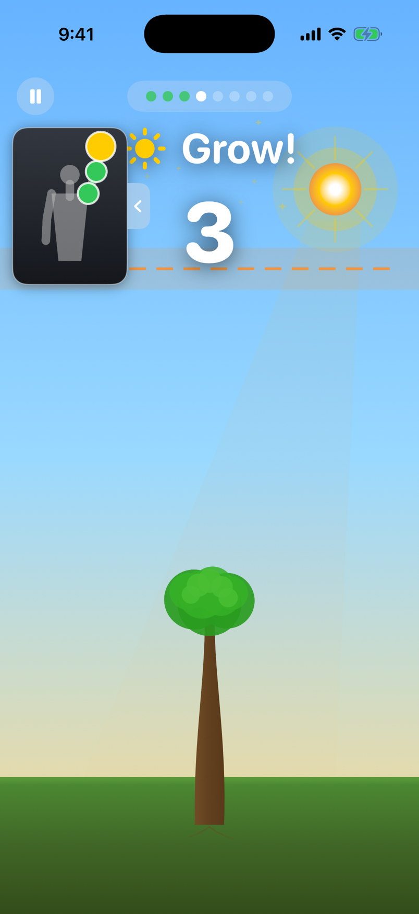
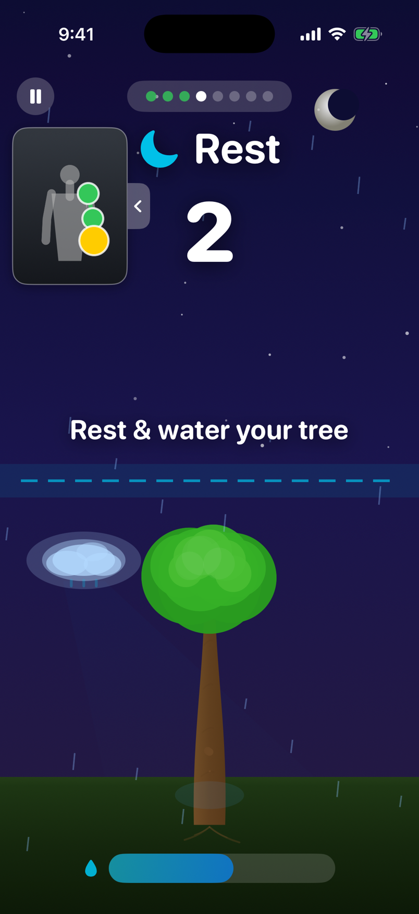
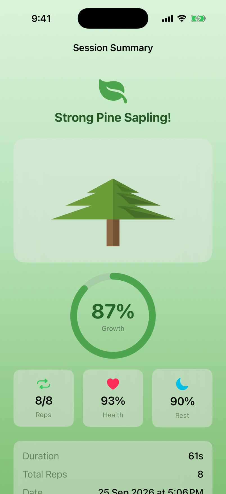
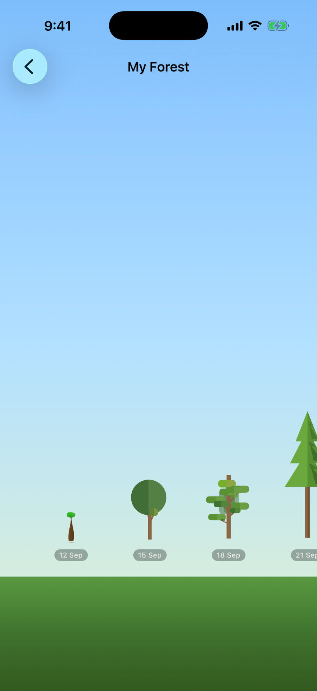
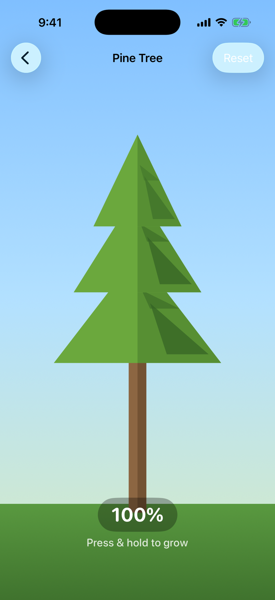

# MusicArc

**A gamified iOS rehabilitation app for burn recovery patients, using real-time camera-based pose estimation to turn prescribed shoulder stretching exercises into an interactive tree-growing game.**

Built entirely with Apple's first-party frameworks — SwiftUI, Vision, AVFoundation, SwiftData, and Combine — with zero third-party dependencies. All graphics are procedurally rendered and all audio is synthesized at runtime; the app ships with no image or sound assets.

---

## Motivation

Patients recovering from burns to the shoulder and axilla must perform repetitive overhead arm-raising and shoulder-extension stretches for weeks to months to restore range of motion and prevent scar contracture. These exercises are painful and monotonous, and at-home adherence is notoriously poor — patients shorten sessions, skip the clinically essential rest periods between stretches, or abandon the protocol entirely.

MusicArc addresses this by turning the exercise itself into the game controller. The patient's arm height, measured in real time through the front camera, drives the growth of a procedurally rendered tree. Raising the arm above a threshold makes the tree grow; lowering it during rest phases "waters" the tree and earns a growth bonus for the next repetition. Skipping rest damages the tree's health — making the physiologically necessary recovery periods mechanically rewarding instead of something to rush through.

The design was developed around the stretching protocol used for shoulder/axilla burn rehabilitation (reps of active stretching separated by mandatory rest), and requires no hardware beyond an iPhone.

## How It Works

A session consists of a configurable number of repetitions, each with an **active phase** and a **rest phase**:

1. **Calibration** (camera mode) — the patient raises and lowers their arm so the app records their *current* range of motion. All subsequent input is normalized against this personal range, so a patient with severely limited mobility gets the same gameplay experience as one in late-stage recovery.
2. **Active phase** — the patient raises their arm above the sunlight threshold. Growth rate scales continuously with how far above the threshold the arm is held, so deeper stretches grow the tree faster.
3. **Rest phase** — the patient lowers their arm below the rest threshold to water the tree. Rest compliance above 70% restores tree health and banks a growth multiplier (up to 1.3×) for the next rep; holding the arm up during rest drains tree health.
4. **Session complete** — results (growth, health, per-rep rest compliance) are persisted locally. The session history screen renders every past session as a tree in a scrollable forest, where each tree's size and color reflect that session's performance — a visual adherence record for both the patient and their care team.

## Screenshots

Captured from the app's own views with sample data; [`docs/ui/`](docs/ui/) has every screen and the script that regenerates them. In the camera screens a silhouette stands in for the live front-camera feed, which the simulator cannot provide; on a device the patient sees themselves, with the same tracking overlay.

<table>
  <tr>
    <td align="center" width="33%">
      
      <br><b>Welcome</b><br>
      The patient's home screen. One large <b>Begin</b> button starts the session the clinician prescribed; <b>My Trees</b> opens the forest of past sessions. Clinicians enter through the link at the bottom.
    </td>
    <td align="center" width="33%">
      
      <br><b>Clinician Setup</b><br>
      Behind a PIN. The clinician sets reps, hold and rest times, the input mode (camera, touch, or auto-demo) and which arm to track, then saves the prescription. <b>Test Run</b> plays it without saving.
    </td>
    <td align="center" width="33%">
      
      <br><b>Calibration</b><br>
      Before a camera session the patient raises and lowers their arm while the app records their current range of motion. The overlay shows the shoulder, elbow and wrist being tracked; the session is then scored relative to this range, so limited mobility is not penalized.
    </td>
  </tr>
  <tr>
    <td align="center">
      
      <br><b>Countdown</b><br>
      A three-second countdown with the two rules of the game: raise your hand to grow the tree, lower it to water the tree.
    </td>
    <td align="center">
      
      <br><b>Active phase (day)</b><br>
      The sun follows the patient's hand. Holding it above the dashed line grows the tree — faster the higher it goes. The card in the top-left shows the camera view with the tracking overlay and can be tucked away with a tap; the dots at the top count reps.
    </td>
    <td align="center">
      
      <br><b>Rest phase (night)</b><br>
      Lowering the arm brings night and rain, filling the water level. A well-watered rest restores tree health and earns a growth bonus for the next rep; keeping the arm up during rest drains health.
    </td>
  </tr>
  <tr>
    <td align="center">
      
      <br><b>Session Summary</b><br>
      Growth, reps completed, tree health and rest compliance for the session. <b>Plant in Forest</b> saves the tree to the patient's history.
    </td>
    <td align="center">
      
      <br><b>My Forest</b><br>
      Every saved session becomes a tree, sized by that session's growth — a progress record patients can read at a glance. Clinicians can export the underlying data.
    </td>
    <td align="center">
      
      <br><b>Tree species</b><br>
      One of five procedurally drawn species (oak, round, bushy, pine, acacia), chosen at random each session. Clinicians can preview each one from the setup screen.
    </td>
  </tr>
</table>

## Technical Overview

### Pose Estimation Pipeline

```
AVCaptureSession → CVPixelBuffer → VNDetectHumanBodyPoseRequest
    → joint extraction (shoulder / elbow / wrist, confidence-gated)
    → arm-length-normalized height ∈ [0, 1]
    → per-patient calibration mapping
    → GameEngine (30 Hz control loop)
```

- **Detection** uses Apple's Vision framework (`VNDetectHumanBodyPoseRequest`) on frames from the front camera, processed off the main thread on a dedicated `userInteractive` queue.
- **Height computation** measures the wrist's vertical displacement from the shoulder, normalized by the detected arm length (upper arm + forearm), yielding a scale-invariant value from 0 (arm fully down) to 1 (fully raised). This makes the measurement robust to the patient's distance from the camera.
- **Graceful degradation**: if the full shoulder–elbow–wrist chain isn't visible, the detector falls back to shoulder–wrist or shoulder–elbow pairs; joints below a confidence threshold are discarded.
- **Calibration** linearly remaps the raw height through the patient's recorded min/max range of motion, so game difficulty adapts to individual recovery progress.

### Input Abstraction

All input sources implement a common `PoseProvider` protocol (Combine publisher of normalized arm height), making the game engine fully input-agnostic:

| Provider | Use case |
|---|---|
| `PoseDetector` | Camera-based pose tracking (primary clinical use) |
| `TouchPoseProvider` | Touch/drag input for patients with limited mobility or no camera |
| `DemoPoseProvider` | Automated input for clinician demonstrations and simulator testing |

### Game Engine

`GameEngine` is an `@Observable` state machine ticking at 30 Hz with delta-time-based updates:

- **Phase scheduling** — `RepScheduler` lays out the session timeline (countdown → alternating active/rest phases per rep → complete); each tick resolves the current phase from elapsed time.
- **Growth model** — growth increments are proportional to arm height above the threshold, normalized per-rep and per-phase-duration, and scaled by the rest bonus multiplier earned in the previous rest phase.
- **Health model** — holding the arm up during rest applies a continuous health penalty; ≥70% rest compliance restores health proportionally. `ScoreTracker` accumulates per-rep growth and rest-compliance metrics for the session summary.
- **Pause/resume** — the engine shifts its reference start time by the pause duration so session timing stays exact.

### Procedural Audio Synthesis

`AudioManager` generates every game sound mathematically at runtime — no audio files:

- Sine-wave oscillators are summed into chords and written directly into `AVAudioPCMBuffer`s at 44.1 kHz.
- A linear attack/release envelope shapes each tone to avoid clicks.
- Buffers are played through `AVAudioEngine`/`AVAudioPlayerNode`, triggered by game events: growth spurts, 10%-growth milestones, day/night phase transitions, and a session-complete arpeggio.

### Procedural Rendering

All visuals are drawn with SwiftUI `Canvas` — the app contains no image assets:

- **Trees** — a `TreeRenderer` protocol with five species implementations (oak, round, bushy, pine, acacia), each drawing continuously as a function of `growth ∈ [0, 1]` and `health ∈ [0, 1]`. Health modulates canopy color saturation, giving intuitive visual feedback on rest compliance without clinical jargon.
- **Environment** — a dynamic sky with day/night transitions synchronized to active/rest phases (sun = stretch, rain = rest/watering), plus particle effects for growth events.

### Persistence

Session results are stored locally with SwiftData (`GameSession` `@Model`): date, duration, rep counts, tree growth, tree health, average rest compliance, input mode, and tree species. The history view queries these to render the forest visualization.

### Privacy

All processing happens on-device. Camera frames are consumed in memory for pose inference only — never stored or transmitted. There are no network calls, analytics, or cloud dependencies anywhere in the app.

## Architecture

```
MusicArc/
├── App/            Entry point and root view
├── Tracking/       PoseProvider protocol, Vision pose detector,
│                   camera capture, touch & demo providers
├── Game/           GameEngine (30 Hz state machine), RepScheduler,
│                   ScoreTracker
├── Audio/          Procedural audio synthesis (AVAudioEngine)
├── Rendering/      TreeRenderer protocol + 5 species renderers
│                   (SwiftUI Canvas)
├── Models/         GameConfig, CalibrationData, Rep, GameResult,
│                   GameSession (SwiftData), TreeSpecies
└── Views/          Welcome, Clinician PIN & Setup, Calibration, Game,
                    Session Summary, Session History, Tree Preview,
                    sky & background views
```

Data flows one way: input providers publish normalized arm height via Combine → the game engine updates game state → SwiftUI observes the engine and re-renders → audio/haptic feedback fires on state transitions.

## Requirements

- iOS 18.0+
- Xcode 16+
- Swift 5.9
- A physical iPhone for camera mode (touch and demo modes work in the simulator)

## Building

The Xcode project is generated with [XcodeGen](https://github.com/yonaskolb/XcodeGen) from `project.yml`:

```bash
# Option 1: open the checked-in project directly
open MusicArc.xcodeproj

# Option 2: regenerate the project from project.yml
xcodegen generate
open MusicArc.xcodeproj
```

Then build and run the `MusicArc` scheme. No dependency installation is required — the project uses no third-party packages.

## Configuration

Session parameters are adjustable so clinicians can prescribe and progress specific protocols:

| Parameter | Default | Description |
|---|---|---|
| Rep count | 8 | Repetitions per session |
| Active duration | 4 s | Length of each stretching phase |
| Rest duration | 3 s | Length of each rest phase |
| Sunlight threshold | 0.7 | Normalized arm height required for growth |
| Rest threshold | 0.3 | Normalized arm height counted as resting |
| Tracking arm | Right | Which arm the pose detector follows |
| Input mode | Touch | Camera / Touch / Auto Demo |
